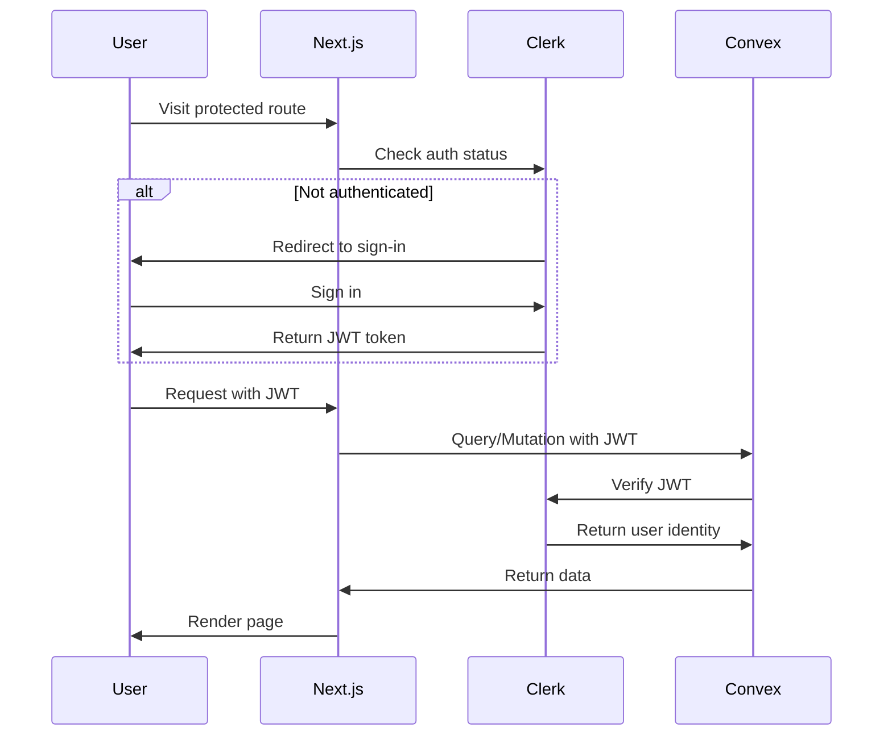

AiVault uses **Clerk** for authentication and integrates it with **Convex** for secure server-side identity verification.

## Authentication Flow



## Clerk Configuration

### Auth Config

Convex is configured to accept JWTs from Clerk:

```javascript convex/auth.config.js
export default {
  providers: [
    {
      domain: "https://hopeful-ringtail-54.clerk.accounts.dev",
      applicationID: "convex",
    },
  ],
};
```

<Note>
This tells Convex to trust JWT tokens issued by the specified Clerk domain.
</Note>

### Environment Variables

```bash .env.local
# Clerk
NEXT_PUBLIC_CLERK_PUBLISHABLE_KEY=pk_test_...
CLERK_SECRET_KEY=sk_test_...

# Convex
NEXT_PUBLIC_CONVEX_URL=https://your-project.convex.cloud
CONVEX_DEPLOY_KEY=prod:your-project|...

# Admin users (comma-separated Clerk user IDs)
NEXT_PUBLIC_ADMIN_USER_IDS=user_abc123,user_xyz789
```

## Protected Routes

### Middleware

Next.js middleware protects routes before they load:

```typescript middleware.ts
import { clerkMiddleware, createRouteMatcher } from "@clerk/nextjs/server";

const isProtectedRoute = createRouteMatcher([
  "/dashboard(.*)",
  "/submit(.*)",
  "/admin(.*)",
]);

export default clerkMiddleware(async (auth, req) => {
  if (isProtectedRoute(req)) {
    await auth.protect();
  }
});

export const config = {
  matcher: [
    "/((?!_next|[^?]*\\.(?:html?|css|js(?!on)|jpe?g|webp|png|gif|svg|ttf|woff2?|ico|csv|docx?|xlsx?|zip|webmanifest)).*)",
    "/(api|trpc)(.*)",
  ],
};
```

### How It Works

1. User visits `/dashboard`
2. Middleware runs before page loads
3. `isProtectedRoute()` checks if path matches patterns
4. If protected and not authenticated, redirects to Clerk sign-in
5. If authenticated, allows request to continue

<Tip>
Middleware runs on **every request**, making it efficient for auth checks without database queries.
</Tip>

## Client-Side Auth

### ConvexProviderWithClerk

```typescript app/providers.tsx
import { ClerkProvider, useAuth } from "@clerk/nextjs";
import { ConvexProviderWithClerk } from "convex/react-clerk";
import { ConvexReactClient } from "convex/react";

const convex = new ConvexReactClient(process.env.NEXT_PUBLIC_CONVEX_URL!);

export default function Providers({ children }: { children: React.ReactNode }) {
  return (
    <ClerkProvider>
      <ConvexProviderWithClerk client={convex} useAuth={useAuth}>
        {children}
      </ConvexProviderWithClerk>
    </ClerkProvider>
  );
}
```

### Layout Integration

```typescript app/layout.tsx:37-50
export default function RootLayout({ children }: { children: React.ReactNode }) {
  return (
    <html lang="en" className={inter.variable} suppressHydrationWarning>
      <body className="min-h-screen flex flex-col font-sans antialiased selection:bg-primary/30">
        <Providers>
          <Navbar />
          <main className="flex-1 flex flex-col">{children}</main>
          <Footer />
        </Providers>
        <Analytics />
      </body>
    </html>
  );
}
```

<Note>
`ConvexProviderWithClerk` automatically attaches Clerk JWT tokens to all Convex queries and mutations.
</Note>

## Server-Side Identity

### Get User Identity

In Convex functions, verify the authenticated user:

```typescript convex/tools.ts:21-25
async function getIdentity(ctx: QueryCtx | MutationCtx) {
  const identity = await ctx.auth.getUserIdentity();
  if (!identity) throw new Error("Unauthenticated");
  return identity;
}
```

### Identity Object

```typescript
interface UserIdentity {
  subject: string;      // Clerk user ID (e.g., "user_abc123")
  tokenIdentifier: string;
  email?: string;
  name?: string;
  pictureUrl?: string;
  // ... other Clerk user fields
}
```

### Usage in Queries

```typescript convex/tools.ts:128-137
export const getSubmittedTools = query({
  args: {},
  handler: async (ctx: QueryCtx) => {
    const identity = await getIdentity(ctx);
    
    // Filter by authenticated user
    return await ctx.db
      .query("tools")
      .withIndex("by_submittedBy", (q) => q.eq("submittedBy", identity.subject))
      .collect();
  },
});
```

### Usage in Mutations

```typescript convex/tools.ts:169-171
export const submitTool = mutation({
  handler: async (ctx: MutationCtx, args: any) => {
    const identity = await getIdentity(ctx);
    
    await ctx.db.insert("tools", {
      // ... tool fields
      submittedBy: identity.subject, // Store Clerk user ID
      createdAt: Date.now(),
    });
  },
});
```

## Authorization

### Admin-Only Functions

```typescript convex/tools.ts:6-19
const getAdminIds = () => (process.env.NEXT_PUBLIC_ADMIN_USER_IDS || "")
  .split(",")
  .map((id) => id.trim())
  .filter(Boolean);

async function checkAdmin(ctx: QueryCtx | MutationCtx) {
  const identity = await ctx.auth.getUserIdentity();
  if (!identity) throw new Error("Unauthenticated");

  if (!getAdminIds().includes(identity.subject)) {
    throw new Error("Unauthorized: Admin access required");
  }
  return identity;
}
```

### Protected Admin Query

```typescript convex/tools.ts:139-147
export const getPendingTools = query({
  handler: async (ctx: QueryCtx) => {
    await checkAdmin(ctx); // Throws if not admin
    
    return await ctx.db
      .query("tools")
      .withIndex("by_approved", (q) => q.eq("approved", false))
      .collect();
  },
});
```

### Protected Admin Mutation

```typescript convex/tools.ts:207-217
export const approveTool = mutation({
  args: { toolId: v.id("tools") },
  handler: async (ctx: MutationCtx, args) => {
    await checkAdmin(ctx); // Verify admin
    
    await ctx.db.patch(args.toolId, { approved: true });
    return { success: true };
  },
});
```

<Warning>
Always check authorization on the **server-side** (Convex functions). Never rely on client-side checks.
</Warning>

## UI Components

### Sign-In Button

```typescript
import { SignInButton, SignedIn, SignedOut, UserButton } from "@clerk/nextjs";

function Navbar() {
  return (
    <nav>
      <SignedOut>
        <SignInButton mode="modal">
          <button>Sign In</button>
        </SignInButton>
      </SignedOut>
      
      <SignedIn>
        <UserButton afterSignOutUrl="/" />
      </SignedIn>
    </nav>
  );
}
```

### Conditional Rendering

```typescript
import { useUser } from "@clerk/nextjs";

function SubmitButton() {
  const { isSignedIn, user } = useUser();
  
  if (!isSignedIn) {
    return <SignInButton>Sign in to submit</SignInButton>;
  }
  
  return <button>Submit Tool</button>;
}
```

### Admin-Only UI

```typescript
import { useUser } from "@clerk/nextjs";

const ADMIN_IDS = process.env.NEXT_PUBLIC_ADMIN_USER_IDS?.split(",") || [];

function AdminPanel() {
  const { user } = useUser();
  
  if (!user || !ADMIN_IDS.includes(user.id)) {
    return null; // Hide from non-admins
  }
  
  return <div>Admin Dashboard</div>;
}
```

<Note>
UI-level checks are for UX only. Always enforce authorization in Convex functions.
</Note>

## JWT Token Flow

1. **User signs in** → Clerk issues JWT token
2. **Token stored** → Browser stores token (httpOnly cookie)
3. **Request made** → ConvexProviderWithClerk attaches token to request
4. **Convex receives** → Extracts JWT from request headers
5. **Convex verifies** → Validates JWT with Clerk's public key
6. **Identity returned** → `ctx.auth.getUserIdentity()` returns user data

```typescript
// Client-side
const tools = useQuery(api.tools.getSubmittedTools, {});
// Automatically includes JWT in request

// Server-side (Convex)
export const getSubmittedTools = query({
  handler: async (ctx) => {
    // Convex has already verified JWT
    const identity = await ctx.auth.getUserIdentity();
    // identity.subject is the Clerk user ID
  },
});
```

## Security Best Practices

<AccordionGroup>
  <Accordion title="Never trust client data">
    Always verify user identity on the server (Convex functions) using `ctx.auth.getUserIdentity()`.
    
    ```typescript
    // ✗ BAD - trusts client
    mutation({
      args: { userId: v.string() },
      handler: async (ctx, args) => {
        await ctx.db.insert("tools", {
          submittedBy: args.userId // Client could fake this!
        });
      }
    });
    
    // ✓ GOOD - verifies on server
    mutation({
      handler: async (ctx, args) => {
        const identity = await ctx.auth.getUserIdentity();
        await ctx.db.insert("tools", {
          submittedBy: identity.subject // Server-verified
        });
      }
    });
    ```
  </Accordion>
  
  <Accordion title="Protect sensitive queries">
    Throw errors for unauthenticated or unauthorized access.
    
    ```typescript
    export const getPrivateData = query({
      handler: async (ctx) => {
        const identity = await ctx.auth.getUserIdentity();
        if (!identity) throw new Error("Must be signed in");
        
        // Return user-specific data
      }
    });
    ```
  </Accordion>
  
  <Accordion title="Store user IDs, not emails">
    Use Clerk's `user.id` (the `subject` field) as the primary identifier. Emails can change.
    
    ```typescript
    submittedBy: identity.subject // "user_abc123" - immutable
    ```
  </Accordion>
  
  <Accordion title="Separate admin config">
    Store admin user IDs in environment variables, not in code or database.
    
    ```bash
    NEXT_PUBLIC_ADMIN_USER_IDS=user_abc123,user_xyz789
    ```
  </Accordion>
</AccordionGroup>

## Testing Authentication

### Local Development

1. Create Clerk account at [clerk.com](https://clerk.com)
2. Create new application
3. Copy API keys to `.env.local`
4. Run `npm run dev`
5. Sign in through UI

### Testing Protected Routes

```bash
# Not signed in
curl http://localhost:3000/dashboard
# → Redirects to Clerk sign-in

# Signed in
curl -H "Authorization: Bearer <clerk-jwt>" http://localhost:3000/dashboard
# → Returns protected content
```

### Testing Convex Functions

```typescript
import { ConvexTestingHelper } from "convex-test";

test("authenticated query", async () => {
  const t = new ConvexTestingHelper();
  
  // Mock authenticated user
  t.setAuth({ subject: "user_test123" });
  
  const tools = await t.query(api.tools.getSubmittedTools, {});
  expect(tools).toBeDefined();
});
```

## Troubleshooting

<AccordionGroup>
  <Accordion title="Error: Unauthenticated">
    - Check that `ConvexProviderWithClerk` wraps your app
    - Verify Clerk environment variables are set
    - Ensure `convex/auth.config.js` domain matches Clerk domain
  </Accordion>
  
  <Accordion title="Error: Unauthorized">
    - Check user ID is in `NEXT_PUBLIC_ADMIN_USER_IDS`
    - Verify comma-separated format (no spaces)
    - Restart dev server after changing `.env.local`
  </Accordion>
  
  <Accordion title="Middleware not protecting routes">
    - Check `matcher` in `middleware.ts` includes your route
    - Verify `isProtectedRoute` pattern matches
    - Clear Next.js cache: `rm -rf .next`
  </Accordion>
</AccordionGroup>

## Next Steps

<CardGroup cols={2}>
  <Card title="Convex Backend" icon="server" href="/development/convex-backend">
    Learn how to use ctx.auth in queries and mutations
  </Card>
  <Card title="Tech Stack" icon="layer-group" href="/development/tech-stack">
    Understand the full technology stack
  </Card>
</CardGroup>
