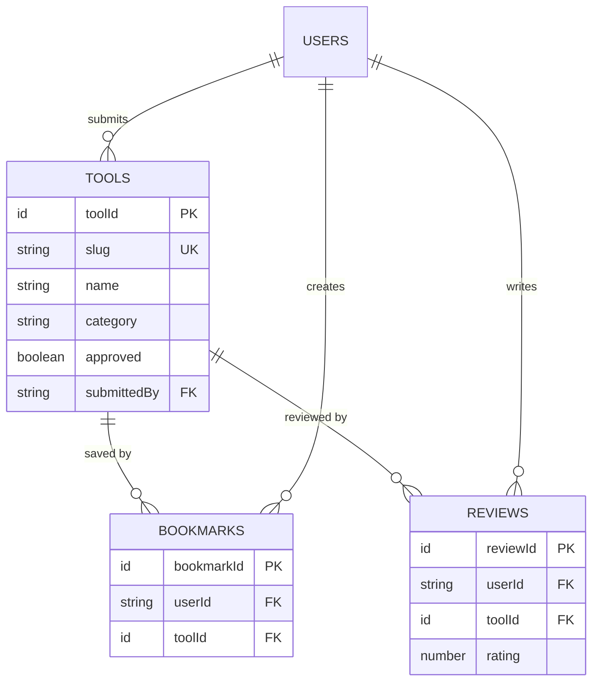

AiVault uses Convex as its database with three main tables: `tools`, `bookmarks`, and `reviews`.

## Schema Overview

The schema is defined in `convex/schema.ts` using Convex's type-safe schema builder.

```typescript convex/schema.ts
import { defineSchema, defineTable } from "convex/server";
import { v } from "convex/values";

export default defineSchema({
  tools: defineTable({...}),
  bookmarks: defineTable({...}),
  reviews: defineTable({...})
});
```

## Tools Table

Stores all AI tools submitted to the directory.

### Fields

```typescript convex/schema.ts
tools: defineTable({
  // Core fields
  name: v.string(),
  slug: v.string(),
  description: v.string(),
  longDescription: v.optional(v.string()),
  category: v.string(),
  tags: v.array(v.string()),
  websiteUrl: v.string(),
  logoUrl: v.optional(v.string()),
  
  // Pricing
  pricing: v.string(), // "Free", "Freemium", "Paid"
  pricingDetails: v.optional(v.string()),
  
  // Metadata
  upvotes: v.number(),
  submittedBy: v.string(), // userId
  approved: v.boolean(),
  createdAt: v.number(),
  featured: v.optional(v.boolean()),
  isNew: v.optional(v.boolean()),
  
  // Rich content
  features: v.optional(v.array(v.string())),
  useCases: v.optional(v.array(v.string())),
  pros: v.optional(v.array(v.string())),
  cons: v.optional(v.array(v.string())),
  platforms: v.optional(v.array(v.string())),
  lastUpdated: v.optional(v.string()),
  
  // Social links
  twitterUrl: v.optional(v.string()),
  githubUrl: v.optional(v.string()),
  discordUrl: v.optional(v.string()),
})
```

### Indices

Convex uses indices for efficient querying:

```typescript convex/schema.ts
.index("by_slug", ["slug"])
.index("by_category", ["category"])
.index("by_approved", ["approved"])
.index("by_submittedBy", ["submittedBy"])
.index("by_upvotes", ["upvotes"])
.index("by_createdAt", ["createdAt"])
```

<Note>
Indices are required for efficient filtering in Convex. Every query should use an index as the starting point.
</Note>

### Key Patterns

| Field | Type | Purpose |
|-------|------|----------|
| `slug` | `string` | Unique URL-friendly identifier |
| `approved` | `boolean` | Admin approval status (moderation) |
| `submittedBy` | `string` | Clerk user ID of submitter |
| `upvotes` | `number` | Popularity metric |
| `createdAt` | `number` | Unix timestamp (milliseconds) |
| `pricing` | `string` | "Free", "Freemium", or "Paid" |
| `platforms` | `string[]` | "Web", "iOS", "Android", "Desktop", "API", "Chrome Extension" |

## Bookmarks Table

Tracks user-saved tools.

```typescript convex/schema.ts
bookmarks: defineTable({
  userId: v.string(),
  toolId: v.id("tools"),
})
  .index("by_userId", ["userId"])
  .index("by_toolId", ["toolId"])
  .index("by_userId_and_toolId", ["userId", "toolId"])
```

### Relationships

- **userId** → Clerk user identifier
- **toolId** → Foreign key reference to `tools` table

### Query Patterns

```typescript
// Get all bookmarks for a user
await ctx.db
  .query("bookmarks")
  .withIndex("by_userId", q => q.eq("userId", userId))
  .collect();

// Check if user bookmarked a specific tool
await ctx.db
  .query("bookmarks")
  .withIndex("by_userId_and_toolId", q => 
    q.eq("userId", userId).eq("toolId", toolId)
  )
  .first();
```

<Tip>
The composite index `by_userId_and_toolId` enables efficient bookmark existence checks without scanning all user bookmarks.
</Tip>

## Reviews Table

User-submitted ratings and comments.

```typescript convex/schema.ts
reviews: defineTable({
  userId: v.string(),
  toolId: v.id("tools"),
  rating: v.number(),
  comment: v.string(),
  createdAt: v.number(),
})
  .index("by_toolId", ["toolId"])
  .index("by_userId", ["userId"])
```

### Fields

| Field | Type | Description |
|-------|------|-------------|
| `userId` | `string` | Clerk user ID |
| `toolId` | `Id<"tools">` | Reference to tool |
| `rating` | `number` | 1-5 star rating |
| `comment` | `string` | Review text |
| `createdAt` | `number` | Timestamp |

### Query Examples

```typescript
// Get all reviews for a tool
const reviews = await ctx.db
  .query("reviews")
  .withIndex("by_toolId", q => q.eq("toolId", toolId))
  .collect();

// Calculate average rating
const avgRating = reviews.reduce((sum, r) => sum + r.rating, 0) / reviews.length;
```

## Relationships Diagram



<Note>
Convex doesn't enforce foreign key constraints at the database level. Referential integrity is maintained through application logic.
</Note>

## Type Safety

Convex automatically generates TypeScript types from the schema:

```typescript
import { Doc, Id } from "./_generated/dataModel";

// Get full tool type
type Tool = Doc<"tools">;

// Get tool ID type
type ToolId = Id<"tools">;

// Use in functions
function displayTool(tool: Tool) {
  console.log(tool.name); // ✓ Type-safe
  console.log(tool.invalid); // ✗ Type error
}
```

## Schema Migrations

Convex handles schema changes automatically:

1. Update `schema.ts`
2. Push changes: `npx convex dev`
3. Convex validates and migrates data

<Warning>
Adding required fields to existing tables requires providing default values or backfilling data first.
</Warning>

## Best Practices

<AccordionGroup>
  <Accordion title="Always use indices">
    Start every query with `.withIndex()`. Table scans are slow and may hit Convex limits.
    
    ```typescript
    // ✓ Good
    await ctx.db.query("tools").withIndex("by_category", q => q.eq("category", cat)).collect();
    
    // ✗ Bad - table scan
    await ctx.db.query("tools").filter(q => q.eq(q.field("category"), cat)).collect();
    ```
  </Accordion>
  
  <Accordion title="Use optional fields for nullable data">
    Mark fields that may not always be present as optional with `v.optional()`.
    
    ```typescript
    logoUrl: v.optional(v.string()) // May be missing
    ```
  </Accordion>
  
  <Accordion title="Store timestamps as numbers">
    Use `Date.now()` for timestamps (Unix milliseconds) for efficient sorting and filtering.
    
    ```typescript
    createdAt: Date.now() // 1709467200000
    ```
  </Accordion>
  
  <Accordion title="Create composite indices for multi-field queries">
    If you frequently query by multiple fields, create a composite index.
    
    ```typescript
    .index("by_userId_and_toolId", ["userId", "toolId"])
    ```
  </Accordion>
</AccordionGroup>

## Next Steps

<CardGroup cols={2}>
  <Card title="Convex Backend" icon="server" href="/development/convex-backend">
    Learn how to query and mutate data
  </Card>
  <Card title="Authentication" icon="lock" href="/development/authentication">
    Understand user identity and permissions
  </Card>
</CardGroup>
